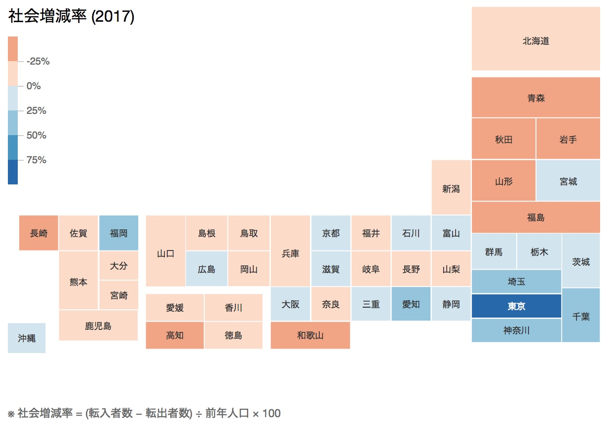

# Grid Map using D3

A tiny js code snippet to generate grid-ish map for data visualization using D3.js.

## Demo

The map layout was inspired by [data.go.jp](http://www.data.go.jp/list-of-database/local-government/).

## Contributing

If you have any ideas let [@nobuf](https://github.com/nobuf) know by opening an issue. Pull requests are always welcome :)

## License

MIT